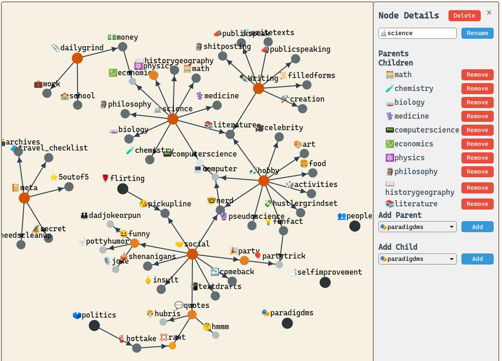

# DyNotes: Dynamic Note-Taking with Tag Visualization

DyNotes is a powerful note-taking application that allows users to organize their thoughts using a dynamic tag system visualized as an interactive graph.



## Features

- Create and manage notes with rich text formatting
- Organize notes using a flexible tag system
- Visualize tag relationships with an interactive graph
- Search notes using text and tag filters
- Adjust note visibility for privacy control
- Edit and delete existing notes

## Getting Started

### Prerequisites

- Python 3.7+
- Flask
- SQLite3

### Installation

1. Clone the repository:
   ```
   git clone https://github.com/yourusername/dynotes.git
   cd dynotes
   ```

2. Install the required dependencies:
   ```
   pip install -r requirements.txt
   ```

3. Initialize the database:
   ```
   python app.py
   ```

4. Access the application:
   Open your web browser and navigate to `http://localhost:5000`

## Development Workflow

1. Make changes to `tagGraph.ts`
2. Compile TypeScript to JavaScript:
   ```
   tsc
   ```
3. Run the Flask application:
   ```
   python app.py
   ```
4. View changes in your browser at `http://localhost:5000`
5. Repeat steps 1-4 as needed

## Deployment

When deploying the application, make sure to update the API endpoints in `tagGraph.js`:

Replace all instances of:
```javascript
fetch("/some_path")
```
with:
```javascript
fetch("/%entrypoint_for_your_website%/some_path")
```

## Contributing

Contributions are welcome! Please feel free to submit a Pull Request.

## License

This project is licensed under the MIT License - see the [LICENSE](LICENSE) file for details.
